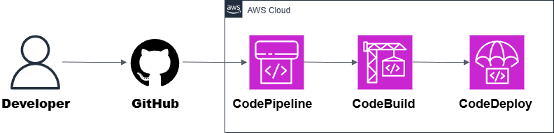

## 🧭 Repository Context

This repository is part of a modularization effort to separate each of the **8 most common AWS architectures** into independent projects.  
The code and resources here were **extracted from a general repository** that originally contained all 8 architectures, to improve clarity, maintainability, and reuse.

🔗 [Original Repository – AWS Architectures Collection](https://github.com/hongzz0618/aws-architecture-collection)

---

## 🚀 AWS CI/CD Pipeline on AWS

This project shows how to build a simple and scalable **CI/CD pipeline** using AWS services.  
It automates the process of building, testing, and deploying a Node.js application using **Infrastructure as Code** with Terraform.

---

## 📐 Architecture

### Main Services
- **GitHub / CodeCommit** → Source code repository (this example uses GitHub).
- **CodePipeline** → Orchestrates the CI/CD workflow (Source → Build → Deploy).
- **CodeBuild** → Builds and tests the app, generates artifacts.
- **CodeDeploy** → Deploys the app to AWS (e.g., Lambda).
- **IAM** → Manages permissions for each service with least privilege.

---

## ✅ Why This Pattern?

| Feature             | Benefit                                      |
|---------------------|----------------------------------------------|
| **Automated delivery** | Every commit can trigger a full pipeline run |
| **Repeatable & auditable** | Track builds, deployments, and artifacts |
| **Extensible**      | Add test stages, approvals, or security scans |
| **Fully managed**   | Low maintenance using AWS native services     |

---

## 🌍 Real-World Use Cases
- Continuous delivery for serverless applications
- Automated testing and deployment of microservices
- Infrastructure-as-Code pipelines with Terraform
- GitOps workflows using GitHub or CodeCommit

---

## 📦 What’s Inside
- Architecture diagram
- Terraform code to provision:
  - IAM roles and policies
  - CodeBuild project
  - CodeDeploy application and deployment group
  - CodePipeline connected to GitHub
- `buildspec.yml` for build steps and artifact packaging
- `appspec.yml` and lifecycle hooks for CodeDeploy
- Example Node.js app with a simple endpoint
- Deployment scripts and usage instructions
